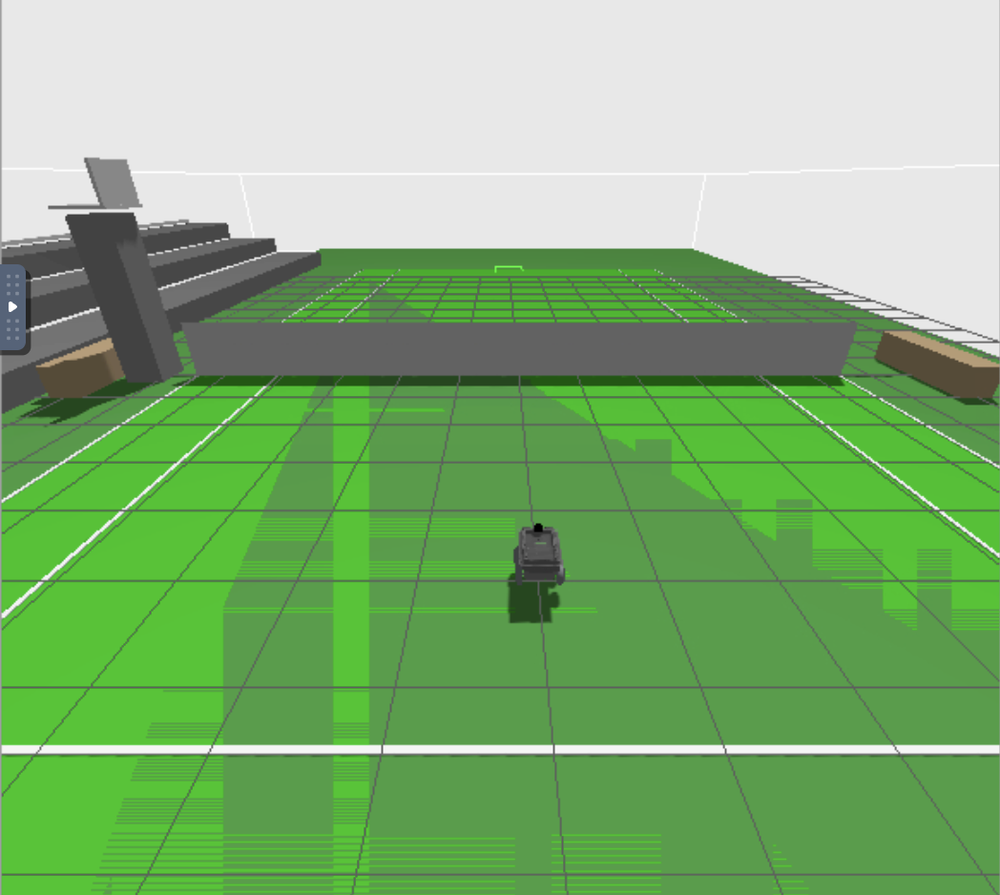

# Tennis Buddy

## About


## Installation

#### Requirements: 
  - ROS2
  - Gazebo
  - Isaac Lab (optional for Nvidia GPU purpose)

We provide docker container integration of stacks above, please check:
[docker/readme.md](docker/README.md)

## Usage
Make sure the source is loaded:
```commandline
source /opt/ros/humble/setup.bash
```
Build
```commandline
cd tennisbuddy 
# ./tennisbuddy/tennisbuddy

colcon build
source install/setup.sh
```

## Simulation
Run in Gazebo:
```commandline
ros2 launch tennisbuddy_gazebo mini_gazebo.launch.py world:=court.sdf
```
