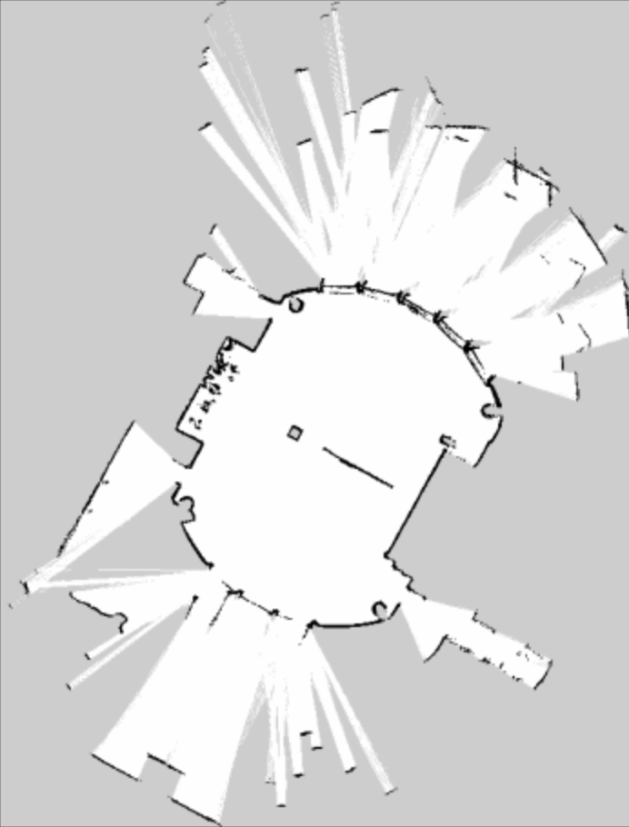

# Tennis Buddy

## About


## Installation

#### Requirements: 
  - ROS2
  - Gazebo (default simulator)
  - Isaac Sim (optional, for NVIDIA GPU acceleration)

We provide docker container integration of stacks above, please check:
[docker/readme.md](docker/README.md)

## Usage
Make sure the source is loaded:
```commandline
source /opt/ros/humble/setup.bash
```
Build
```commandline
cd tennisbuddy 
# make sure you are under ./tennis_buddy/tennisbuddy

ln -s ../deps deps
colcon build
source install/setup.sh
```

## Running

### Run the robot
```commandline
ros2 launch tennisbuddy_ros2_control miti_65.launch.py
```
#### Running the New Map with Slam
```
ros2 launch tennisbuddy_perception slam_launch.py
```
#### Drive the Robot in the New Map
```
ros2 run teleop_twist_keyboard teleop_twist_keyboard
```
#### Save yaml and pgm
```
ros2 run nav2_map_server map_saver_cli -f ~/final
```
#### Save posegraph
```
ros2 service call /slam_toolbox/serialize_map slam_toolbox/srv/SerializePoseGraph “{filename: ‘/home/$USER/final.posegraph’, allow_header_reset: false}”
```



## Simulation

### Gazebo (Default)
Run in Gazebo:
```commandline
ros2 launch tennisbuddy_gazebo miti_65_gazebo.launch.py world:=court.sdf
```


### Isaac Sim (Optional, GPU-accelerated)
Run in Isaac Sim:
```commandline
ros2 launch tennisbuddy_isaac_sim miti_65_isaac_sim.launch.py world:=court.usd
```

### Unified Launch (Choose Simulator)
Choose between Gazebo and Isaac Sim:
```commandline
# Use Gazebo (default)
ros2 launch tennisbuddy_simulation miti_65_sim.launch.py simulator:=gazebo world:=court

# Use Isaac Sim
ros2 launch tennisbuddy_simulation miti_65_sim.launch.py simulator:=isaac_sim world:=court
```

**Note**: Both simulators use the same ROS2 interface and topics, ensuring full compatibility. See [tennisbuddy/simulation/README.md](tennisbuddy/simulation/README.md) for details.

### Simulation Testing
```
ros2 launch tennisbuddy_gazebo miti_65_gazebo.launch.py world:=court.sdf world_name:=tennis_world use_sim_time:=true
ros2 launch tennisbuddy_perception ball_spawner.launch.py world:=tennis_world count:=15
ros2 launch tennisbuddy_perception perception_gazebo_gt.launch.py world:=tennis_world
ros2 launch tennisbuddy_planning navigation_launch.py use_sim_time:=true slam:=true map_file_name:=/home/autobots/tennis_buddy/tennisbuddy/ros2_control/maps/court_mapv2
ros2 launch tennisbuddy_planning planning_nav2_goal.launch.py use_sim_time:=true publish_initial_pose:=true
```