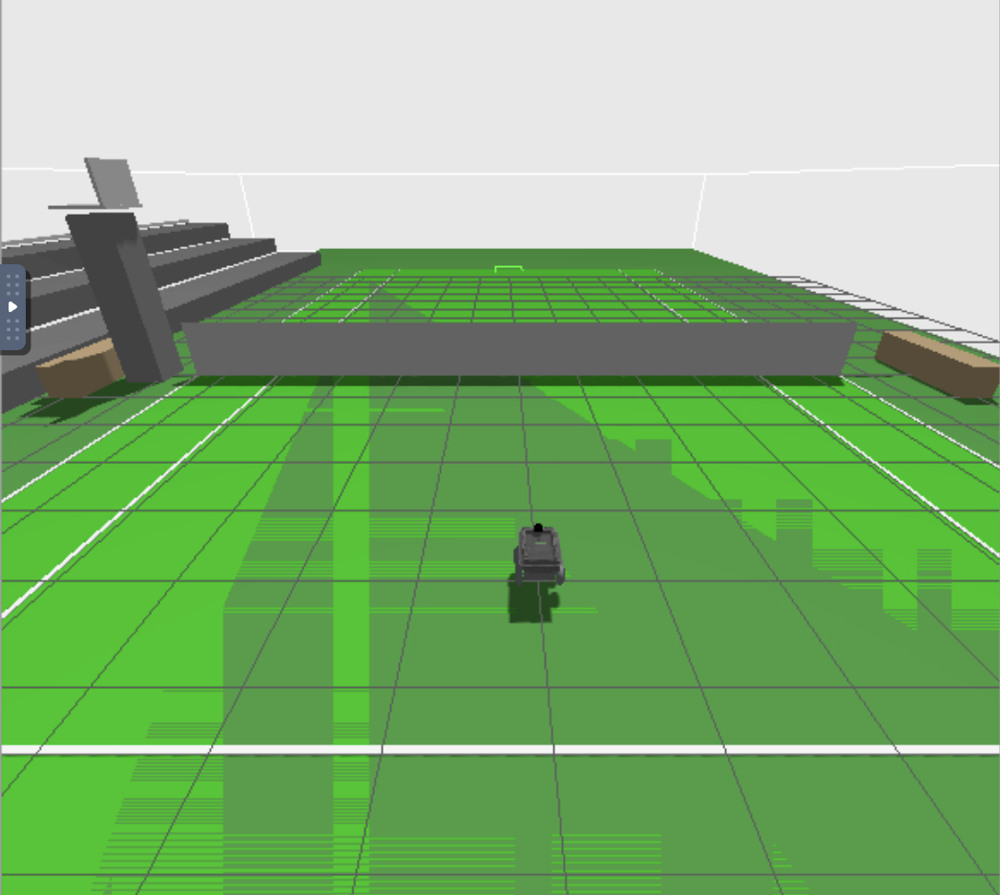

# Tennis Buddy

## About


## Installation

#### Requirements: 
  - ROS2
  - Gazebo
  - Isaac Lab (optional for Nvidia GPU purpose)

We provide docker container integration of stacks above, please check:
[docker/readme.md](docker/README.md)

## Usage
Make sure the source is loaded:
```commandline
source /opt/ros/humble/setup.bash
```
Build
```commandline
cd tennisbuddy 
# ./tennisbuddy/tennisbuddy

colcon build
source install/setup.sh
```

## Simulation
Run in Gazebo:
```commandline
ros2 launch tennisbuddy_gazebo miti_65_gazebo.launch.py world:=court.sdf
```



## Testing
```
ros2 launch tennisbuddy_gazebo miti_65_gazebo.launch.py world:=court.sdf world_name:=tennis_world use_sim_time:=true
ros2 launch tennisbuddy_perception ball_spawner.launch.py world:=tennis_world count:=15
ros2 launch tennisbuddy_perception perception_gazebo_gt.launch.py world:=tennis_world
ros2 launch tennisbuddy_planning navigation_launch.py use_sim_time:=true slam:=true map_file_name:=/home/autobots/tennis_buddy/tennisbuddy/ros2_control/maps/court_mapv2
ros2 launch tennisbuddy_planning planning_nav2_goal.launch.py use_sim_time:=true
```

# 
```
ros2 action send_goal /navigate_to_pose nav2_msgs/action/NavigateToPose "
pose:
  header:
    frame_id: 'map'
    stamp:
      sec: 0
      nanosec: 0
  pose:
    position:
      x: 2.0
      y: 1.0
      z: 0.0
    orientation:
      x: 0.0
      y: 0.0
      z: 0.0
      w: 1.0
"
```