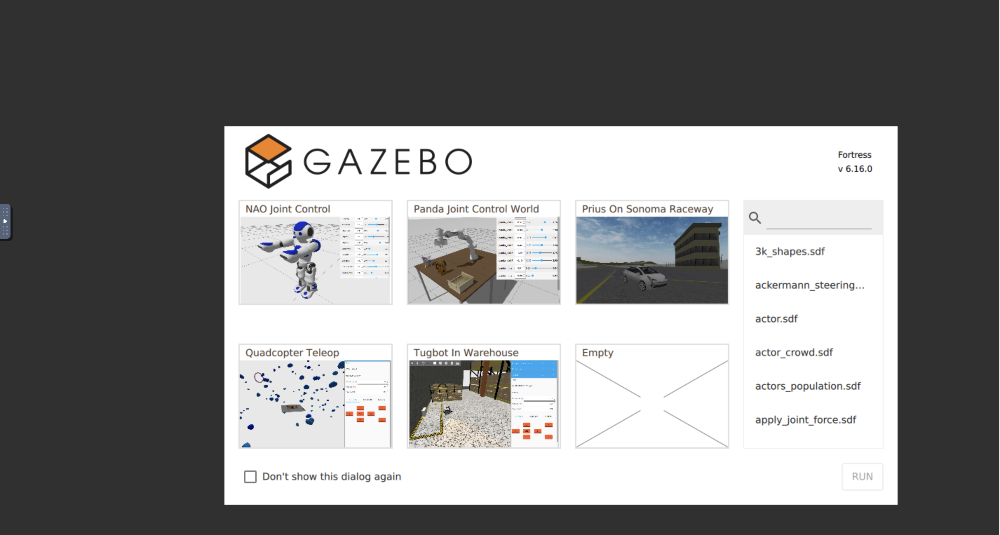

## Docker Usage

### Install (Ros2 + Gazebo)

#### Support
 - MacOS (Apple Silicon)
 - Linux
 - Windows ??

#### Build Image
```
docker build -f docker/Dockerfile --build-arg ROS_DISTRO=humble --build-arg SIM=gazebo -t tennisbuddy .
```
#### Run Container
```
docker run -it --rm -p 5901:5901 -p 6080:6080 tennisbuddy
```
Visit website at http://localhost:6080/vnc.html to access the Gazebo GUI.

Password: `tennisbuddy`




### Install (Ros2 + Issac Lab)
